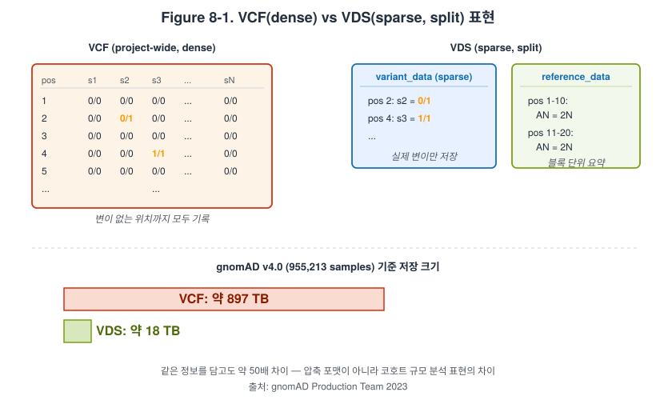

# Chapter 8. EMR과 Hail로 하는 대규모 WGS 분석

## 학습 목표

- AWS EMR이 무엇인지 설명할 수 있다.
- Hail이 Spark 기반 유전체 분석 도구로 왜 중요한지 이해할 수 있다.
- Hail `VariantDataset (VDS)`가 cohort-scale 분석에서 왜 중요한지 설명할 수 있다.
- WGS 수준의 대규모 변이 분석에서 EMR과 Hail의 장단점을 개괄할 수 있다.

## 핵심 질문

- EC2 여러 대를 직접 관리하는 것과 EMR을 쓰는 것은 어떻게 다른가
- Hail은 어떤 데이터 구조와 계산 모델을 사용하는가
- gnomAD와 같은 자원이 왜 Hail 생태계와 잘 맞는가
- 왜 VDS는 "큰 VCF"를 더 크게 만든 것이 아니라, 다른 데이터 표현인가

## 8.1 왜 EMR인가 - 직접 Spark 클러스터 대신 관리형 분산 분석

AWS EMR은 Spark, Hadoop, Hive, Trino 같은 분산 데이터 처리 도구를 더 쉽게 운영하도록 만든 관리형 플랫폼이다. 초보자에게는 "Spark 클러스터를 대신 띄워 주는 서비스"라고 설명해도 출발점으로는 충분하다. 하지만 유전체 분석 맥락에서 더 중요한 점은, EMR이 단순히 노드를 여러 대 띄우는 일을 넘어 클러스터 구성, 스케일링, 로그, 스토리지 연결을 하나의 운영 체계로 묶어 준다는 사실이다. WGS처럼 샘플 수와 변이 수가 동시에 커지는 분석에서는 계산 자체보다 `어떻게 분산 환경을 안정적으로 굴릴 것인가`가 더 큰 부담이 되기 쉽다. EMR은 바로 이 운영 부담을 줄여 주는 계층이다.

EMR을 이해할 때 자주 놓치는 포인트는 데이터 위치다. 전통적인 Hadoop 사고에서는 데이터를 HDFS로 먼저 옮겨 놓고 그 위에서 계산하는 흐름이 강했다. 하지만 AWS에서는 S3가 사실상의 기본 저장 계층이고, EMR은 EMRFS를 통해 S3 데이터를 직접 읽고 쓰는 구조를 자연스럽게 제공한다. 이 점은 오믹스 연구자에게 매우 중요하다. 이미 S3에 있는 VCF, Parquet, annotation table, 공개 데이터 자산을 다시 별도 스토리지로 복사하지 않고도 분산 계산에 연결할 수 있기 때문이다. 즉 EMR의 가치는 노드 수보다 `S3 위의 데이터 레이크와 분산 계산을 자연스럽게 이어 준다`는 데 있다.

## 8.2 Hail이 무엇인가 - MatrixTable, Table, Spark

Hail은 Spark 위에서 유전체 데이터를 다루기 좋게 설계된 분산 분석 라이브러리다. 학생에게는 이를 "유전체학을 위한 분산 데이터프레임 환경" 정도로 소개하면 이해가 빠르다. Hail의 핵심 자료구조 가운데 하나인 `MatrixTable`은 행과 열이 각각 변이와 샘플에 대응하는 거대한 유전형 행렬을 표현하는 데 적합하다. 여기에 annotation, QC 지표, phenotype, covariate를 연결하면 cohort-scale 분석을 상대적으로 일관된 방식으로 표현할 수 있다. 즉 Hail은 Spark 자체를 직접 다루게 하기보다, Spark 위에 유전체 분석에 맞는 언어를 얹은 도구라고 볼 수 있다.

`joonan-lab/hail_tutorial`이 보여 주는 흐름은 Hail 교육의 좋은 출발점이다. VCF import로 시작해 MatrixTable 구조를 이해하고, 샘플 정보와 annotation을 붙이고, QC를 수행하고, qualifying variant를 추출하고, 마지막에 association testing까지 나아간다. AWS EMR 장에서는 이 개념 흐름을 그대로 유지하되, 입력 데이터를 `s3://...` 경로에서 읽고 계산이 Spark executor에 의해 병렬로 확장된다는 점만 추가하면 된다. 즉 로컬 튜토리얼과 클라우드 튜토리얼은 서로 다른 과목이 아니라, 같은 분석 사고를 다른 규모로 확장한 버전이다. 이 관점이 있어야 학생이 Hail을 "클라우드 전용 도구"가 아니라 "규모가 커질수록 더 빛나는 도구"로 이해할 수 있다.

## 8.3 VariantDataset - sparse representation, reference blocks, local alleles

Hail을 제대로 이해하려면 `VariantDataset (VDS)`를 따로 배워야 한다. Hail 문서에 따르면 VDS는 `variant_data`와 `reference_data`를 분리한 sparse, split representation이다. 즉 모든 샘플과 모든 위치를 dense하게 펼쳐 쓰는 대신, 실제 변이가 있는 부분과 참조 블록(reference block)을 나누어 저장한다. 이 구조의 핵심은 단순히 파일을 더 작게 만드는 데 있지 않다. 오히려 대규모 코호트를 실제로 다룰 수 있는 데이터 표현을 만드는 데 있다. Hail 문서와 All of Us 문서는 모두 VDS를 `stores less data, but more information`에 가까운 구조로 설명한다.

이 차이는 production-scale 사례에서 훨씬 선명해진다. gnomAD v4.0은 exome callset 생성 과정에서 VDS를 사용했고, 955,213 samples 규모의 전체 데이터를 18 TB로 유지할 수 있었지만 전통적 project VCF였다면 897 TB가 필요했을 것이라고 설명한다. 이 수치는 VDS가 압축 포맷이 아니라 cohort-scale 분석 표현이라는 사실을 매우 직관적으로 보여 준다. 또한 gnomAD v4.1은 VDS 덕분에 all callable sites에서 allele number를 유지할 수 있었고, 변이가 없는 위치까지 포함한 AN 자원을 제공할 수 있었다. 학생은 여기서 `저장 구조가 곧 과학적 질문의 범위를 바꾼다`는 중요한 교훈을 배워야 한다.

Figure 8-1은 VCF의 dense 표현과 VDS의 sparse, split 표현을 교육용으로 단순화해 비교한 것이다. VCF는 모든 샘플과 모든 위치를 펼쳐 저장하지만, VDS는 참조 블록과 변이 블록을 분리하고 실제 변이가 있는 곳만 저장한다. 같은 데이터를 담아도 정보량은 더 크고 크기는 더 작아지는 이 대비를 시각적으로 기억하면, 이후 cohort-scale 분석에서 왜 저장 구조가 질문의 범위를 바꾸는지 쉽게 떠올릴 수 있다.

VDS에서 또 하나 중요한 개념은 `local alleles`다. highly multiallelic site에서는 전통적인 VCF식 전역 allele indexing이 매우 비효율적일 수 있다. Hail은 이를 피하기 위해 `LGT`, `LAD`, `LPL`, `LA` 같은 local representation을 사용한다. 이 점은 대규모 분석에서 왜 VDS가 단순한 VCF의 압축판이 아닌지를 보여 주는 좋은 교육 소재다. Hail 문서가 `local_to_global` 변환을 조심하라고 경고하는 이유도 바로 여기에 있다. local 표현을 무심코 전역 표현으로 다시 펴면, 얻는 정보보다 늘어나는 데이터 크기가 훨씬 클 수 있기 때문이다.

## 8.4 Hail 분석 흐름 - import, annotation, QC, qualifying variant, association

실전에서는 Hail을 거창한 분산 이론보다 분석 단계별 흐름으로 배우는 편이 낫다. 첫 단계는 보통 `hl.import_vcf("s3://bucket/path/*.vcf.bgz")`처럼 S3에서 데이터를 읽어 MatrixTable을 만드는 것이다. 다음으로 샘플 정보와 phenotype, annotation table을 결합하고, variant QC와 sample QC를 수행한다. 그다음 기능적 annotation과 필터링을 통해 qualifying variant를 정의하고, 마지막에 burden test나 association testing으로 이어진다. 이 흐름은 로컬이든 EMR이든 동일하다.

EMR이 필요한 이유는 이 분석 흐름의 각 단계가 더 큰 데이터와 더 많은 샘플을 만나면 갑자기 무거워지기 때문이다. import와 repartition, join과 aggregate, annotation lookup, cohort-level summary는 CPU뿐 아니라 메모리와 네트워크 셔플을 함께 요구한다. 따라서 Hail을 AWS에서 크게 돌릴 때는 "무조건 메모리형 인스턴스"보다 stage별 병목을 보는 감각이 중요하다. annotation join과 aggregation은 `r` 계열이, VCF import와 executor 확장이 중요한 단계는 `c` 계열이 더 잘 맞을 수 있다. Hail은 GPU 도구라기보다, CPU 노드 수와 적절한 분산 구조가 더 중요한 도구라는 점도 함께 강조하는 편이 좋다.

## 8.5 EMR on EC2, EMR on EKS, EMR Serverless 비교

2026년 현재 EMR은 하나의 실행 형태만 가진 서비스가 아니다. `EMR on EC2`, `EMR on EKS`, `EMR Serverless` 세 가지 큰 경로가 있다. `EMR on EC2`는 전통적인 형태로, 클러스터 구성을 가장 명시적으로 제어할 수 있고 Spark와 HDFS 문화에 익숙한 팀에게 잘 맞는다. `EMR on EKS`는 이미 Kubernetes 중심의 플랫폼을 운영하는 조직에서 유리하다. 반면 `EMR Serverless`는 클러스터를 직접 관리하고 싶지 않은 팀에게 매력적이지만, 장시간 실행과 큰 executor 조정이 필요한 일부 유전체 워크로드에서는 사전 검토가 더 필요하다. 따라서 학생에게는 "어느 것이 최신이라서 정답"이라고 가르치기보다, 조직이 이미 어떤 플랫폼을 갖고 있는지에 따라 선택이 달라진다고 설명하는 편이 낫다.

Table 1은 교육용으로 세 실행 형태를 비교한 것이다. 여기서 중요한 것은 기능 나열이 아니라, 운영 철학이 다르다는 점이다. 즉 `EMR on EC2`는 클러스터 제어권, `EMR on EKS`는 플랫폼 통합, `EMR Serverless`는 운영 단순화에 더 가깝다. Hail을 처음 배울 때는 보통 `EMR on EC2`로 이해를 시작하는 것이 가장 직관적이다. 하지만 연구실이나 기관이 이미 Kubernetes를 운영 중이라면 `EMR on EKS`가 더 자연스러울 수 있다. 학생은 기술 선택이 언제나 분석 규모만으로 결정되지 않고, 조직의 기존 운영 방식과도 깊게 연결된다는 점을 이 장에서 함께 배워야 한다.

Table 1. EMR의 세 가지 실행 형태

| 형태 | 장점 | 주의점 | 잘 맞는 상황 |
|---|---|---|---|
| EMR on EC2 | 제어권이 크고 전통적 Spark 설명과 잘 맞음 | 클러스터 개념을 더 많이 이해해야 함 | 처음 Hail/EMR을 배우는 팀, Spark 중심 분석 |
| EMR on EKS | Kubernetes 기반 플랫폼과 잘 통합됨 | EKS 운영 경험이 없으면 오히려 복잡함 | 이미 EKS를 운영 중인 조직 |
| EMR Serverless | 클러스터 관리 부담이 적음 | 일부 장시간·대형 워크로드는 사전 검토 필요 | 간헐적 사용, 운영 단순화 우선 팀 |

## 8.6 로컬 Hail 튜토리얼을 AWS EMR로 확장하기

학생에게 가장 좋은 학습 경로는 로컬 튜토리얼의 개념을 먼저 익힌 뒤, 같은 개념을 AWS EMR로 확장하는 것이다. 예를 들어 `joonan-lab/hail_tutorial`에서 VCF import, MatrixTable 구조, QC, annotation, association testing을 익혔다면, EMR에서는 입력만 `s3://...`로 바꾸고 실행 환경을 Spark cluster로 넓히면 된다. 이때 개념은 그대로인데 규모와 운영 방식만 달라진다는 점이 중요하다. 클라우드는 새로운 분석법을 강요하는 곳이 아니라, 같은 분석을 더 큰 규모로 반복 가능하게 만드는 곳이다.

이 장의 결론은 간단하다. Hail은 Spark 위에서 유전체 데이터를 다루기 쉽게 만든 분석 계층이고, EMR은 그 계층을 AWS에서 안정적으로 운영하도록 돕는 실행 계층이다. VDS는 대규모 코호트를 위한 데이터 표현이고, S3는 그 데이터를 두는 공유 저장 계층이다. 학생이 이 네 요소의 관계를 이해하면, gnomAD, All of Us, cohort-scale WGS 분석 같은 주제가 더 이상 막연한 "거대한 데이터"가 아니라 설계 가능한 분석 구조로 보이기 시작한다.

## 핵심 개념 정리

- EMR은 Spark/Hadoop 클러스터를 AWS에서 더 쉽게 운영하기 위한 관리형 계층이다.
- Hail의 `MatrixTable`과 `VDS`는 서로 다른 분석 목적을 가진 자료구조이며, 같은 것으로 보면 안 된다.
- VDS는 reference block과 variant data를 분리한 sparse representation이므로 cohort-scale 분석에 특히 유리하다.
- Hail을 AWS에서 크게 돌릴 때는 stage별 병목에 따라 인스턴스와 실행 형태를 고르는 감각이 중요하다.

## 복습 질문

1. EMR on EC2, EMR on EKS, EMR Serverless는 각각 어떤 조직 상황에 더 잘 맞는가?
2. VDS가 전통적 project VCF보다 유리한 이유를 저장과 질의 두 관점에서 설명해 보라.
3. 로컬 Hail 튜토리얼과 EMR 기반 Hail 분석은 무엇이 같고 무엇이 다른가?

## Further Reading

- Hail. [Amazon Web Services](https://hail.is/docs/0.2/cloud/amazon_web_services.html).
- Hail. [Variant Dataset (VDS)](https://hail.is/docs/0.2/vds/index.html).
- joonan-lab. [hail_tutorial](https://github.com/joonan-lab/hail_tutorial).

## References

- All of Us Research Program. 2024. [The new VariantDataset (VDS) format for All of Us short-read WGS data](https://support.researchallofus.org/hc/en-us/articles/14927774297620-The-new-VariantDataset-VDS-format-for-All-of-Us-short-read-WGS-data).
- AWS. 2026a. [What is Amazon EMR?](https://docs.aws.amazon.com/emr/latest/ManagementGuide/emr-what-is-emr.html).
- AWS. 2026b. [Amazon EMR on EKS](https://docs.aws.amazon.com/emr/latest/EMR-on-EKS-DevelopmentGuide/emr-eks.html).
- AWS. 2026c. [Amazon EMR Serverless](https://docs.aws.amazon.com/emr/latest/EMR-Serverless-UserGuide/emr-serverless.html).
- gnomAD Production Team. 2023. [gnomAD v4.0](https://gnomad.broadinstitute.org/news/2023-11-gnomad-v4-0/).
- Hail. 2026d. [Amazon Web Services](https://hail.is/docs/0.2/cloud/amazon_web_services.html).
- Hail. 2026e. [Variant Dataset (VDS)](https://hail.is/docs/0.2/vds/index.html).
- He Q et al. 2025. [The Scalable Variant Call Representation: Enabling Genetic Analysis Beyond One Million Genomes](https://academic.oup.com/bioinformatics/article/41/1/btae746/7932121).
