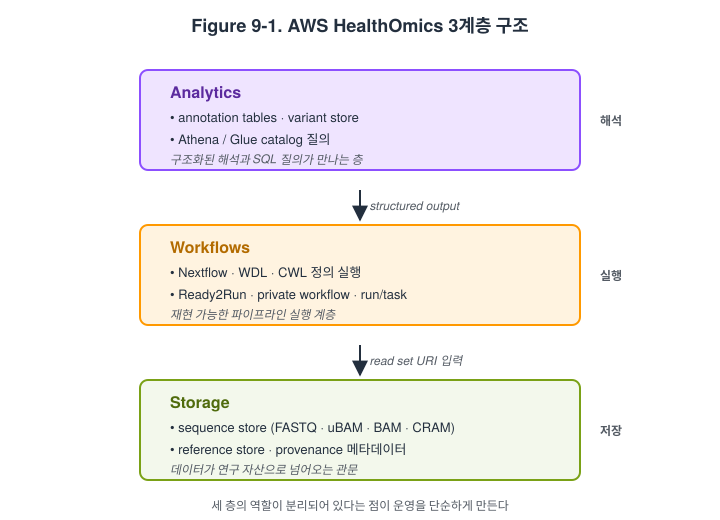

# 9장. AWS HealthOmics와 Nextflow 파이프라인

## 학습 목표

- AWS HealthOmics의 목적과 핵심 기능을 설명할 수 있다.
- Nextflow 기반 파이프라인을 관리형 서비스에서 돌리는 장점을 이해할 수 있다.
- 워크플로우 실행, 입력 데이터, 출력 저장의 흐름을 설명할 수 있다.

## 핵심 질문

- HealthOmics는 일반 EC2 운영과 무엇이 다른가
- Nextflow를 HealthOmics에 연결하면 어떤 점이 편해지는가
- 어떤 연구실은 HealthOmics가 맞고 어떤 연구실은 직접 운영이 나은가

## 관리형 오믹스 플랫폼의 등장 배경

유전체 분석을 AWS에서 운영할 때 가장 먼저 부딪히는 문제는 계산 자원 자체보다 운영 복잡성이다. 컨테이너를 어디에 둘지, 참조 유전체를 어떻게 배포할지, 샘플별 입력 manifest를 어떻게 만들지, 재시도와 로그를 어떻게 관리할지, 결과를 어떤 경로로 남길지 같은 문제가 빠르게 쌓인다. EC2와 Batch만으로도 충분히 강력한 시스템을 만들 수 있지만, 그만큼 사용자가 직접 이해하고 관리해야 하는 요소도 많다. AWS HealthOmics는 바로 이런 복잡성을 일부 흡수하기 위해 등장한 purpose-built omics 서비스다. 학생에게는 이를 `오믹스 workflow를 위한 관리형 실행·저장 계층`으로 이해시키는 편이 적절하다.

HealthOmics를 설명할 때는 보통 `Storage`, `Workflows`, `Analytics` 세 축으로 구분하면 이해가 쉽다. 다만 현재형으로는 `Analytics`의 일부 기능이 신규 고객에게 제한되어 있다는 점을 함께 적어 두는 편이 안전하다. 중요한 것은 서비스 이름보다 역할이다. 즉 Storage는 read set과 reference를 다루는 데이터 운영 계층, Workflows는 WDL, Nextflow, CWL 기반의 실행 계층, Analytics는 구조화된 해석과 질의에 가까운 계층으로 이해하면 된다. 학생은 여기서 "관리형이므로 아무것도 몰라도 된다"는 인상을 받으면 안 된다. HealthOmics는 복잡성을 줄여 주지만, 컨테이너, 입력 구조, 권한, 참조 데이터 관리 같은 핵심 문제를 그 자체로 사라지게 하지는 않는다.

Figure 9-1은 HealthOmics의 세 계층을 가장 단순한 형태로 정리한 것이다. Storage는 시퀀싱 원시와 중간 산물을 표준화된 read set으로 보관하고, Workflows는 Nextflow/WDL/CWL 정의를 실제로 실행하고, Analytics는 annotation과 질의 가능한 테이블을 만드는 계층이다. 세 계층이 분리되어 있다는 점이 이 서비스의 핵심이다. 한 층에서 받은 데이터를 다음 층에서 자연스럽게 넘기는 흐름이 전체 운영을 단순하게 만든다.

## Sequence store, read set, reference store, run

HealthOmics의 Storage 계층은 단순 S3 버킷과는 조금 다른 운영 철학을 가진다. Sequence store는 `FASTQ`, `uBAM`, `BAM`, `CRAM` 같은 데이터를 read set 단위로 관리하며, ingest 과정에서 provenance와 ETag 같은 운영 메타데이터를 남긴다. 또한 read set 태그와 S3 tag propagation을 활용해 샘플 단위 운영 규칙을 설계할 수 있다. 학생에게는 이를 `파일 모음`이 아니라 `연구 데이터 운영 단위`로 설명하는 편이 낫다. 즉 HealthOmics는 단순 저장을 넘어서 데이터의 상태와 출처를 함께 관리하려는 계층이다.

이 점은 시퀀싱 센터 데이터 handoff를 설명할 때 특히 유용하다. 시퀀싱 회사에서 파일이 도착하면, 연구실은 이를 그냥 폴더에 복사해 두는 대신 sequence store나 S3를 통해 명시적 운영 계층으로 등록할 수 있다. 이후 각 샘플은 read set으로 식별되고, 메타데이터 JSON이나 manifest와 연결되며, 워크플로 입력으로 넘겨진다. 또한 활성 read set은 S3 URI로 접근할 수 있으므로, IGV, HTSlib/samtools, Nextflow, CWL/WDL과 직접 연결되는 흐름도 만들 수 있다. 즉 sequence store는 단순 저장소가 아니라 `시퀀싱 데이터가 분석 가능한 연구 자산으로 넘어오는 관문`에 가깝다.

## Nextflow, Ready2Run, private workflow 연결 방식

HealthOmics Workflows 계층의 핵심은 표준 workflow 언어를 관리형 환경에서 실행할 수 있게 해 준다는 점이다. 공식 문서는 WDL, Nextflow, CWL을 지원하며, Nextflow는 특정 버전군과 DSL1/DSL2에 대한 지원 규칙을 제공한다. 초보자에게 중요한 것은 `Nextflow를 몰라도 HealthOmics를 쓸 수 있다`가 아니라, `Nextflow를 이미 아는 연구실은 더 적은 운영 부담으로 같은 파이프라인을 돌릴 수 있다`는 사실이다. 즉 관리형 서비스는 workflow 언어를 대체하지 않고, 그 실행 계층을 단순화한다.

그러나 관리형이라고 해서 workflow 정의를 이해하지 않아도 되는 것은 아니다. HealthOmics의 Nextflow 문서는 `publishDir`, `errorStrategy`, `maxRetries`, `omicsRetryOn5xx`, `time` directive 같은 구체적 동작을 명시적으로 다룬다. 이 점은 교육적으로 중요하다. 학생은 관리형 서비스가 숨겨 주는 복잡성과 숨겨 주지 못하는 복잡성을 구분해 배워야 한다. 컨테이너가 ECR에 어떻게 올라가 있는지, 입력 manifest가 어떤 구조인지, 어떤 step이 재시도 가능한지, 결과가 어디에 남는지 같은 질문은 여전히 사용자가 이해해야 한다.

Ready2Run workflows는 또 다른 진입 경로를 제공한다. 이는 third-party나 사전 구성된 workflow를 바로 사용할 수 있게 해 주는 형태로, 인프라 자체를 설계하기보다 결과 해석과 실험 운영에 집중하고 싶은 팀에 적합하다. 반면 private workflow는 연구실이 직접 관리하는 Nextflow pipeline을 HealthOmics에 올리는 방식이다. 따라서 교육용으로는 `Ready2Run = 빠른 시작`, `private workflow = 더 큰 유연성`이라는 대비가 유용하다. 둘 중 어느 것이 더 낫다고 말하기보다, 연구실의 기술 역량과 반복 사용 패턴에 맞추어 고르는 방식으로 설명하는 편이 현실적이다.

## 다중 워크플로우 orchestration과 샘플 핸드오프

실제 연구실 운영에서는 샘플 하나짜리 파이프라인보다 여러 샘플과 여러 workflow가 연결된 구조가 더 흔하다. AWS의 `Orchestrating Multiple AWS HealthOmics Workflows at Scale` 사례는 이 점을 잘 보여 준다. 이 구조에서 S3의 metadata JSON 업로드는 단순 파일 저장이 아니라 이벤트의 시작점이다. Lambda와 Step Functions가 이를 감지하고, 샘플별 HealthOmics workflow와 QC workflow를 병렬로 실행한다. 즉 클라우드 네이티브 오믹스 운영은 "스크립트 하나를 돌린다"보다 "메타데이터 이벤트가 파이프라인을 움직인다"에 더 가깝다.

이런 구조는 시퀀싱 회사 데이터 handoff에도 매우 잘 맞는다. 예를 들어 vendor가 S3나 sequence store에 데이터를 전달하면, 연구실은 이를 read set으로 등록하고, 샘플 메타데이터를 JSON이나 manifest로 정리하고, 이를 기준으로 Nextflow 또는 Ready2Run workflow를 자동 실행할 수 있다. 그 뒤 QC와 결과가 S3에 쌓이고, 필요한 경우 Athena나 후속 분석 계층으로 넘어간다. 학생에게는 이 흐름을 `vendor upload -> registration -> metadata -> workflow -> QC -> downstream analysis`라는 일직선으로 보여 주는 것이 이해에 도움이 된다. 관리형 서비스의 진짜 가치는 버튼 클릭 수보다 이런 운영 흐름을 표준화하기 쉽게 만든다는 데 있다.

## 시퀀싱 회사 데이터 납품에서 자동 전처리까지

이 장에서 가장 실용적인 질문은 "AWS를 쓰면 시퀀싱 회사에서 나온 데이터를 바로 전처리할 수 있는가?"이다. 답은 가능하지만, `그냥 올려 두면 자동 처리된다`는 식으로 이해하면 곤란하다. 먼저 데이터가 어디로 들어오는지, sample metadata가 어떤 형식인지, 어떤 pipeline이 어떤 참조 유전체와 컨테이너를 쓰는지, 실패 시 누가 어떻게 재실행할지까지 정해야 한다. HealthOmics는 이 구조를 구현하는 데 필요한 많은 부분을 제공하지만, 운영 규칙 그 자체를 대신 설계해 주지는 않는다. 따라서 학생은 서비스 사용법과 함께 `연구실의 데이터 계약`도 같이 배워야 한다.

여기서 data lake, lakehouse, warehouse 사고방식도 연결된다. sequence store나 S3에 원본 read set이 들어오는 단계는 data lake에 가깝다. workflow 결과가 Parquet나 annotation table처럼 반복 질의 가능한 구조로 변환되는 순간부터 lakehouse 사고가 시작된다. cohort dashboard나 임상 요약 리포트가 만들어지는 단계는 warehouse에 가깝다. 즉 HealthOmics 장은 단지 workflow 실행 장이 아니라, 데이터가 원본에서 구조화된 분석 자산으로 이동하는 과정을 보여 주는 장이기도 하다. 이 연결을 이해하면 뒤에서 나올 Athena, Bedrock, 통합 예제 장이 훨씬 자연스럽게 이어진다.

## 핵심 개념 정리

- HealthOmics는 `Storage + Workflows (+ 일부 Analytics)`라는 세 층으로 이해하는 것이 가장 쉽다.
- 관리형 서비스는 운영 부담을 줄여 주지만, 컨테이너, 입력 구조, 권한, 참조 데이터 관리를 대신 설계해 주지는 않는다.
- Sequence store와 read set은 단순 파일 저장을 넘어 provenance와 운영 메타데이터를 포함한 연구 데이터 계층이다.
- 시퀀싱 데이터 handoff에서 중요한 것은 파일 업로드 자체보다 metadata와 workflow orchestration의 연결이다.

## 복습 질문

1. HealthOmics가 EC2나 Batch 중심 직접 운영과 다른 점은 무엇인가?
2. Nextflow를 HealthOmics에 올릴 때 관리형이 숨겨 주는 복잡성과 여전히 사용자가 이해해야 하는 복잡성은 각각 무엇인가?
3. 시퀀싱 회사에서 도착한 데이터를 자동 전처리로 연결하려면 어떤 메타데이터와 운영 규칙이 필요한가?

## Further Reading

- AWS. [What is AWS HealthOmics?](https://docs.aws.amazon.com/omics/latest/dev/what-is-healthomics.html).
- AWS. [Workflow definition specifics for Nextflow](https://docs.aws.amazon.com/omics/latest/dev/workflow-definition-nextflow.html).
- AWS. [Orchestrating multiple AWS HealthOmics workflows at scale](https://aws.amazon.com/blogs/industries/orchestrating-multiple-aws-healthomics-workflows-at-scale/).

## References

- AWS. 2026a. [What is AWS HealthOmics?](https://docs.aws.amazon.com/omics/latest/dev/what-is-healthomics.html).
- AWS. 2026b. [AWS HealthOmics pricing](https://aws.amazon.com/healthomics/pricing/).
- AWS. 2026c. [Sequence stores](https://docs.aws.amazon.com/omics/latest/dev/sequence-stores.html).
- AWS. 2026d. [Create a sequence store](https://docs.aws.amazon.com/omics/latest/dev/create-sequence-store.html).
- AWS. 2026e. [Accessing HealthOmics read sets with Amazon S3 URIs](https://docs.aws.amazon.com/omics/latest/dev/s3-access.html).
- AWS. 2026f. [Workflow definition specifics for Nextflow](https://docs.aws.amazon.com/omics/latest/dev/workflow-definition-nextflow.html).
- AWS. 2026g. [Supported workflow language versions](https://docs.aws.amazon.com/omics/latest/dev/workflows-lang-versions.html).
- AWS. 2026h. [Ready2Run workflows](https://docs.aws.amazon.com/omics/latest/dev/Ready2Run-workflows.html).
- AWS Industries Blog. 2024. [Orchestrating multiple AWS HealthOmics workflows at scale](https://aws.amazon.com/blogs/industries/orchestrating-multiple-aws-healthomics-workflows-at-scale/).
