# Chapter 13. 클라우드 네이티브 single-cell과 spatial omics - Zarr, AnnData, OME-Zarr, SOMA

## 학습 목표

- 대규모 single-cell과 spatial omics에서 왜 `파일 전체 다운로드` 방식이 점점 비효율적인지 설명할 수 있다.
- `AnnData`, `h5ad`, `Zarr`, `OME-Zarr`, `TileDB-SOMA`가 각각 어느 추상화 계층에 있는지 구분할 수 있다.
- scRNA-seq과 spatial transcriptomics가 왜 서로를 대체하기보다 보완하는지 설명할 수 있다.
- AWS에서 S3, 분산 계산, 웹 시각화를 이용해 클라우드 네이티브 오믹스 분석을 설계하는 기본 사고방식을 이해할 수 있다.

## 핵심 질문

- 왜 큰 `h5ad` 파일 하나를 열어 두는 방식만으로는 최신 single-cell과 spatial omics를 다루기 어려운가
- 왜 single-cell에서는 정렬보다 annotation과 benchmarking이 더 큰 병목이 되기 시작했는가
- Zarr는 단순한 파일 포맷이 아니라 어떤 접근 패턴의 변화를 뜻하는가
- OME-Zarr와 TileDB-SOMA는 Zarr와 어떤 관계에 있으며, 언제 서로 다른 선택지가 되는가

## 이 장의 구성

이 장은 내용이 빽빽하므로 네 부분으로 나누어 읽는 것이 좋다. 각 부분은 독립적인 질문에 답한다.

- **Part A. 왜 파일 중심 사고가 무너졌는가** (13.1 ~ 13.2): 대규모 single-cell이 인프라 문제가 된 배경.
- **Part B. 저장 모델의 전환** (13.3 ~ 13.4): Zarr의 chunk 기반 접근과 AnnData/Zarr 조합.
- **Part C. 공간·이미징으로의 확장** (13.5 ~ 13.6): OME-Zarr, SpatialData, single-cell + spatial 통합.
- **Part D. 플랫폼과 운영** (13.7 ~ 13.9): TileDB-SOMA, AWS 실전 배치, 한계와 주의점.

개념이 처음이라면 Part A → B 순서로 두 부분만 먼저 읽고 13.9 요약으로 넘어가도 좋다. Part C, D는 필요할 때 다시 돌아와 참조하면 된다.

## Part A. 왜 파일 중심 사고가 무너졌는가

## 13.1 왜 `download -> open` 패턴이 무너지기 시작했는가

대규모 생물학 데이터 분석은 오랫동안 `파일을 내려받아 로컬에서 연다`는 전제를 바탕으로 발전해 왔다. 이 방식은 작은 bulk RNA-seq 데이터나 제한된 수의 샘플을 다룰 때는 충분히 실용적이었다. 그러나 single-cell, spatial transcriptomics, 다중 모달 오믹스, 고해상도 현미경 이미지가 합쳐지기 시작하면서 병목은 계산보다 데이터 접근 방식에서 먼저 드러났다. 이제 문제는 파일을 어디에 저장하느냐가 아니라, 필요한 세포 집단과 유전자 집합, 공간 영역, 이미지 해상도만 골라 빠르게 읽고 바로 계산할 수 있느냐로 바뀌었다. 즉 분석의 중심 단위가 `파일 전체`에서 `필요한 조각`으로 이동하기 시작한 것이다.

이 변화는 단순한 저장 형식의 차이로 설명하기 어렵다. 예전에는 데이터를 한 번 로컬에 받으면 그다음부터는 디스크 속도와 메모리만 신경 쓰면 되었다. 반면 객체 스토리지 시대에는 네트워크를 건너 어떤 조각을 몇 번 읽는지, 작은 객체가 얼마나 많은지, 메타데이터를 어떻게 관리하는지가 성능과 비용을 동시에 결정한다. 따라서 오늘날의 omics 교육에서는 파일 포맷을 저장 형식으로만 가르쳐서는 부족하다. 어떤 접근 패턴이 어떤 저장 구조와 맞는지를 함께 가르쳐야 한다. 이 장은 바로 그 전환을 single-cell과 spatial omics라는 가장 극적인 사례를 통해 설명한다.

## 13.2 single-cell은 왜 인프라 문제가 되었는가

single-cell RNA-seq이 기존 유전체 분석과 다른 이유는 데이터 규모가 샘플 수보다 세포 수에 의해 결정된다는 점이다. 하나의 실험에서 수만 개에서 수백만 개의 세포가 측정되고, 데이터는 본질적으로 거대한 `cells x genes` 희소 행렬이 된다. 이 구조에서는 단순 정렬과 카운팅만이 문제가 아니다. batch integration, embedding, cell-type annotation, 방법론 benchmarking 같은 후반부 단계가 점점 더 큰 계산 병목이 된다. 즉 single-cell 시대의 인프라 문제는 `큰 파일 하나를 빨리 읽는 일`보다 `희소 행렬을 반복적으로 비교하고 해석하는 일`에 더 가깝다.

AWS의 Open Problems 사례는 이 점을 잘 보여 준다. 로컬에서 개발된 Docker container와 Nextflow workflow는 실제 benchmarking 단계에서 `ECR -> Nextflow -> AWS Batch -> EC2 Spot -> S3` 구조 위로 확장된다. 이 플랫폼의 목적은 단일 분석을 한 번 빨리 끝내는 것이 아니라, 같은 데이터셋에 여러 알고리즘을 반복 적용하고 성능을 비교하며, spatial deconvolution 같은 과제까지 동일한 실행 계층에서 평가하는 것이다. 즉 single-cell 클라우드는 "더 센 서버"보다 "재현 가능한 대규모 비교 실험실"에 더 가깝다. 이 점을 이해해야 single-cell 인프라가 왜 파일 관리 문제가 아니라 플랫폼 설계 문제가 되었는지 자연스럽게 보이기 시작한다.

Figure 13-1은 기존의 파일 중심 접근과 chunk 기반 원격 접근의 차이를 개념적으로 보여 준다. 같은 데이터를 다룬다고 하더라도, 어떤 단위로 접근하느냐에 따라 네트워크 왕복, 메모리 사용, 비용 구조가 모두 달라진다. 이 차이가 곧 클라우드 네이티브 오믹스의 출발점이다.

## Part B. 저장 모델의 전환

## 13.3 Zarr와 chunk 기반 접근 - 객체 스토리지 시대의 배열 저장

이 전환을 이해하는 데 Zarr는 매우 좋은 교육 도구다. Zarr는 N차원 배열을 작은 chunk 단위로 나누어 저장하고, 각 chunk를 독립적으로 접근 가능한 객체로 다룬다. AWS Public Sector의 Zarr on S3 글은 바로 이 점 때문에 객체 스토리지 위에서 필요한 조각을 빠르게 읽고 병렬 처리할 수 있다고 설명한다. 따라서 Zarr의 핵심은 "확장자 하나가 더 생겼다"가 아니라, `전체 파일 다운로드` 대신 `필요한 조각만 원격에서 읽는다`는 사고방식을 가능하게 해 준다는 데 있다. 클라우드 네이티브 분석이라는 말은 대개 이 chunk 기반 접근을 전제로 한다.

하지만 여기서 바로 중요한 caveat가 나온다. Zarr는 만능이 아니고, `S3에 올리기만 하면 자동으로 빨라진다`고 가르치면 오히려 부정확해진다. 실제 성능과 비용은 chunk 크기, sharding, metadata consolidation, object 수, request pattern에 크게 좌우된다. chunk를 너무 잘게 쪼개면 small object가 폭발하고, request cost와 listing overhead가 커질 수 있다. 따라서 Zarr를 단순 포맷으로 소개하기보다, `저장 구조를 분석 패턴에 맞추는 설계 기술`로 소개하는 편이 교육적으로 훨씬 낫다.

## 13.4 AnnData + Zarr + Vitessce - single-cell 데이터 모델의 클라우드 확장

single-cell 분야에서는 이 흐름을 `AnnData + Zarr`라는 조합으로 가장 쉽게 설명할 수 있다. `AnnData`는 세포 x 유전자 행렬과 `obs`, `var`, `obsm`, `layers`를 함께 다루는 데이터 모델이고, `h5ad`와 `Zarr`는 이를 저장하는 서로 다른 backend라고 보는 편이 가장 자연스럽다. 작은 분석이나 로컬 notebook 실습에서는 `h5ad`가 여전히 편리하다. 그러나 반복 공유, 웹 시각화, remote access, larger-than-memory 분석이 중요해질수록 Zarr backend의 장점이 커진다. AnnData 문서도 `write_zarr()`를 공식 API로 제공하고, zarr v3와 remote access를 중요한 발전 방향으로 다루고 있다.

Vitessce 예제는 이 변화를 학생들에게 직관적으로 보여 준다. 흐름은 `h5ad`를 읽고, 시각화에 필요한 embedding과 feature matrix를 정리한 뒤, `write_zarr()`로 Zarr store를 만들고, 이를 S3에 올려 웹 기반 인터랙티브 뷰어에서 공유하는 방식이다. 즉 single-cell 데이터는 더 이상 개인용 분석 파일에만 머무르지 않고, 객체 스토리지 위에 놓인 배포형 자산이 된다. 이때 Zarr는 단순한 분석 포맷이 아니라 협업과 공유를 위한 배치 전략이 된다. 학생은 여기서 `AnnData = 데이터 모델`, `h5ad/Zarr = 저장 backend`, `Vitessce = 공유/시각화 계층`이라는 추상화 수준을 함께 배워야 혼란이 줄어든다.

## Part C. 공간·이미징으로의 확장

## 13.5 OME-Zarr와 SpatialData - 공간오믹스와 이미징 데이터의 만남

공간오믹스(spatial omics)와 이미징으로 가면 이 논리는 더 강해진다. OME-Zarr는 생물학 이미지와 다중 해상도 피라미드, segmentation, annotation을 클라우드 친화적으로 다루기 위한 포맷이다. spatial omics에서는 세포 x 유전자 행렬만으로는 충분하지 않다. 위치 좌표, 세포 경계, 조직 이미지, 여러 해상도의 시각화 정보를 함께 다뤄야 한다. 이때 `전체 이미지를 다 받지 않고 필요한 타일과 해상도만 읽는다`는 발상은 단순한 편의가 아니라 필수적인 운영 원리가 된다. OME-Zarr가 중요한 이유는 바로 이 멀티스케일 접근을 표준화하려 하기 때문이다.

SpatialData는 이 생태계를 더 상위 수준에서 정리하는 프레임워크다. 공식 문서는 이를 `Images`, `Labels`, `Points`, `Shapes`, `Tables`를 한 좌표계 안에서 함께 다루는 공통 데이터 모델로 설명한다. 교육적으로는 이 구분 자체가 매우 유용하다. 학생은 공간전사체를 단순히 `spot x gene matrix`로만 보는 대신, 여기에 이미지와 세포 경계, 위치 정보, 파생 표가 함께 묶인다는 점을 이해하게 된다. 즉 OME-Zarr는 공간오믹스의 저장과 전달 계층을, SpatialData는 그 위의 통합 표현 계층을 보여 주는 셈이다.

## 13.6 single-cell + spatial integration - matrix에서 matrix + coordinates로

single-cell만으로는 충분하지 않다는 사실도 함께 배워야 한다. scRNA-seq은 세포 정체성과 이질성을 세포 단위로 보여 주지만, 조직 안에서 그 세포가 어디 있었는지는 잃어버린다. spatial transcriptomics는 바로 이 빈틈을 메우지만, 해상도와 유전자 수, 시야 범위 사이의 trade-off를 가진다. 그래서 최신 계산의 핵심은 둘 중 하나를 고르는 것이 아니라 `single-cell + spatial integration`이다. 공간전사체 데이터는 단순한 행렬이 아니라 `matrix + coordinates (+ image)`이며, 실제로는 neighborhood, cell-cell communication, spatial domain, deconvolution까지 함께 해석해야 의미가 커진다.

`gimVI`는 이런 통합 계산의 대표적 예시다. 이 모델은 짝지어지지 않은 scRNA-seq와 spatial 데이터를 함께 사용해 spatial에서 직접 측정되지 않은 유전자 정보를 추정하려는 접근을 보여 준다. 다만 이것을 유일한 표준처럼 가르칠 필요는 없다. 더 중요한 것은 왜 통합 계산이 필요해졌는지를 이해하는 것이다. single-cell은 세포 정체성을 세밀하게 제공하고, spatial은 조직 문맥을 제공하므로, 둘을 함께 봐야 실제 생물학적 해석이 훨씬 풍부해진다.

## Part D. 플랫폼과 운영

## 13.7 CELLxGENE Census와 TileDB-SOMA - 왜 더 큰 플랫폼은 다른 길을 택했는가

여기서 Zarr만이 유일한 길이라고 가르치면 오히려 부정확해진다. CZ CELLxGENE Discover와 Census는 대규모 single-cell 데이터 접근을 위해 TileDB-SOMA를 사용한다. 이 선택은 Zarr가 틀렸다는 뜻이 아니라, tens of millions of cells 규모의 larger-than-memory 질의, cross-language API, 버전된 데이터 스냅샷, 더 엄격한 스키마 관리가 필요한 플랫폼에서는 상위 계층이 달라질 수 있음을 보여 준다. 교육적으로는 `AnnData + Zarr`를 연구자 친화적이고 scverse 중심의 경로로, `TileDB-SOMA`를 더 큰 규모의 플랫폼형 질의 계층으로 설명하는 편이 좋다. 즉 둘은 경쟁 관계라기보다 서로 다른 문제 규모에 대응하는 선택지에 가깝다.

또한 CELLxGENE 플랫폼과 Census object를 구분하는 것도 중요하다. 개별 source dataset은 여전히 `h5ad`로 유통될 수 있지만, corpus-wide query 계층은 `TileDB-SOMA`로 제공된다. 학생이 이 점을 이해하면 "클라우드 네이티브 single-cell"이 반드시 하나의 형식만을 뜻하지 않는다는 사실을 자연스럽게 받아들일 수 있다. 결국 핵심은 특정 확장자에 대한 충성도가 아니라, 어떤 규모와 어떤 질의 패턴에 어떤 데이터 모델이 맞는지를 판단하는 능력이다.

## 13.8 AWS에서의 실전 운영 - S3, Batch, ECS/Fargate, SageMaker, Bedrock

AWS 관점에서 핵심은 결국 같다. 데이터를 S3에 두고, 필요한 부분만 읽고, 계산은 데이터 가까이에서 병렬로 수행하고, 결과는 notebook이나 웹 인터페이스로 다시 연결하는 것이다. AWS의 Zarr 사례는 geospatial 데이터를 예로 들지만, 원리는 single-cell과 spatial omics에도 거의 그대로 적용된다. Dask, ECS/Fargate, SageMaker notebook, S3 VPC endpoint 같은 조합은 대규모 배열 데이터를 클라우드에서 직접 처리하는 전형적인 패턴을 보여 준다. 중요한 것은 `더 큰 인스턴스를 사는 것`이 아니라, 파일이 아니라 chunk를 계산 단위로 바꾸는 것이다.

실제 산업 사례도 비슷한 방향을 보여 준다. Sonrai는 scRNA-seq cluster annotation을 `HealthOmics + S3 + SageMaker + Bedrock` 구조로 자동화했고, One BioSciences는 tens of thousands of RNA profiles를 다루기 위해 `EC2 + S3 + MWAA + Athena + Lambda`와 GPU 자원을 조합했다. 여기서 중요한 점은 AI가 raw omics 전체를 대체한다는 환상이 아니라, annotation과 interpretation 같은 후반부 병목을 줄이는 해석 계층으로 작동한다는 사실이다. 이 장에서 Bedrock은 "모든 분석을 해 주는 엔진"이 아니라, 잘 구조화된 데이터와 워크플로 위에서 마지막 해석 단계를 보조하는 계층으로 이해하는 편이 정확하다. 결국 클라우드 네이티브 omics는 저장, 계산, 시각화, 해석이 느슨하게 연결된 하나의 플랫폼 구조로 보아야 한다.

## 13.9 한계와 주의점 - small objects, sharding, evolving APIs

물론 Zarr와 클라우드 네이티브 접근에는 한계도 분명하다. chunk를 너무 잘게 쪼개면 small object가 급격히 늘고, request cost와 listing 비용이 커질 수 있다. zarr v3의 sharding은 이런 문제를 줄이기 위한 방향이지만, 실제 구현 세부는 계속 진화 중이다. AnnData 문서 기준 일부 기능은 아직 실험적 성격이 있으므로, 교과서에서는 세부 API보다 원리와 설계 감각을 남기는 편이 더 오래간다. 또한 같은 S3에 데이터를 올렸다고 해서 자동으로 빠르고 경제적인 구조가 되는 것은 아니다.

운영 감각도 함께 가르쳐야 한다. compute와 S3를 같은 region에 두는지, private VPC에서 S3 endpoint를 사용하는지, 고동시성 접근에서 `503 Slow Down` 같은 신호를 어떻게 모니터링하는지 같은 문제는 클라우드에서도 여전히 중요하다. Sonrai나 One BioSciences 같은 고객 사례의 시간 단축 수치는 학술 벤치마크가 아니라 사례 보고라는 점도 분명히 적어야 한다. 따라서 이 장의 결론은 단순하다. `h5ad`를 버리자는 것이 아니라, 클라우드 시대의 single-cell과 spatial omics에서는 `전체 파일 중심 사고`에서 `부분 접근 중심 사고`, 나아가 `로컬 분석`에서 `재현 가능한 플랫폼 분석`으로 넘어가야 한다는 점이다.

## 핵심 개념 정리

- single-cell과 spatial omics의 핵심 병목은 큰 파일 자체보다 희소 행렬, 좌표, 이미지, 반복 질의와 통합 계산에 있다.
- `AnnData = 데이터 모델`, `h5ad/Zarr = 저장 backend`, `OME-Zarr = 이미징/공간오믹스 표준화`, `TileDB-SOMA = 플랫폼형 질의 계층`으로 구분하면 이해가 쉬워진다.
- Zarr의 핵심은 파일 확장자가 아니라 chunk 기반 원격 접근과 병렬 계산이라는 접근 패턴이다.
- 클라우드 네이티브 분석은 더 큰 서버를 사는 일이 아니라, 필요한 부분만 읽고 데이터 가까이에서 계산하는 구조를 만드는 일이다.

## 복습 질문

1. 왜 최신 single-cell 분석에서는 정렬보다 annotation과 benchmarking이 더 큰 병목이 되기 시작했는가?
2. `h5ad`와 `Zarr`의 차이를 저장 형식이 아니라 접근 패턴의 차이로 설명해 보라.
3. OME-Zarr와 TileDB-SOMA는 각각 어떤 문제 규모와 어떤 데이터 계층에 더 잘 맞는가?

## Further Reading

- AWS Public Sector Blog. [Decrease geospatial query latency from minutes to seconds using Zarr on Amazon S3](https://aws.amazon.com/blogs/publicsector/decrease-geospatial-query-latency-minutes-seconds-using-zarr-amazon-s3/).
- Vitessce. [Export data to AWS S3](https://python-docs.vitessce.io/notebooks/data_export_s3.html).
- SpatialData. [Documentation](https://spatialdata.scverse.org/en/stable/).

## References

- AnnData. 2026. [AnnData.write_zarr](https://anndata.readthedocs.io/en/latest/generated/anndata.AnnData.write_zarr.html).
- AnnData. 2026. [zarr-v3 Guide/Roadmap](https://anndata.readthedocs.io/en/latest/tutorials/zarr-v3.html).
- AWS Public Sector Blog. 2024. [Decrease geospatial query latency from minutes to seconds using Zarr on Amazon S3](https://aws.amazon.com/blogs/publicsector/decrease-geospatial-query-latency-minutes-seconds-using-zarr-amazon-s3/).
- AWS. 2024. [Driving innovation in single-cell analysis on AWS](https://aws.amazon.com/blogs/publicsector/driving-innovation-single-cell-analysis-aws/).
- AWS. 2025. [One BioSciences case study](https://aws.amazon.com/solutions/case-studies/one-biosciences/).
- AWS. 2025. [Sonrai case study](https://aws.amazon.com/solutions/case-studies/sonrai-bedrock-case-study/).
- Czerny et al. 2025. [CZ CELLxGENE Discover: a single-cell data platform for scalable exploration, analysis, and modeling of aggregated data](https://academic.oup.com/nar/article/53/D1/D886/7912032).
- Lopez et al. 2019. [A joint model of unpaired data from scRNA-seq and spatial transcriptomics for imputing missing gene expression measurements](https://arxiv.org/abs/1905.02269).
- Moore et al. 2023. [OME-Zarr: a cloud-optimized bioimaging file format with international community support](https://link.springer.com/article/10.1007/s00418-023-02209-1).
- SpatialData. 2026. [Documentation](https://spatialdata.scverse.org/en/stable/).
- Vitessce. 2026. [Export data to AWS S3](https://python-docs.vitessce.io/notebooks/data_export_s3.html).
