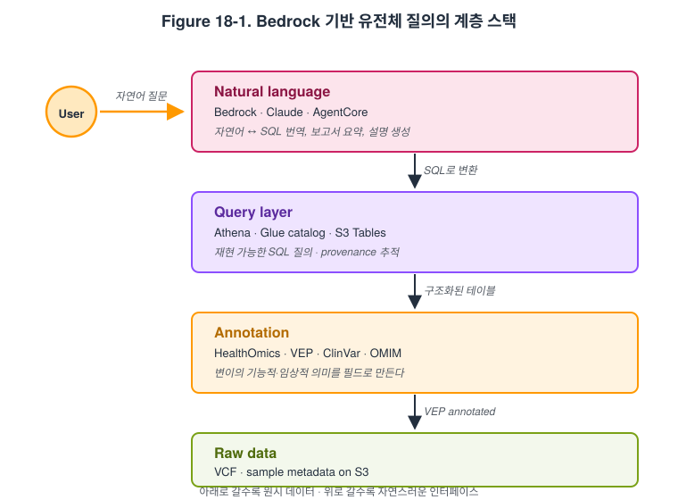

# 18장. Bedrock으로 하는 유전체 질의와 변이 해석

## 학습 목표

- Amazon Bedrock이 유전체 분석에서 어떤 역할을 할 수 있는지 설명할 수 있다.
- HealthOmics, Athena, S3 Tables와 Bedrock을 연결한 자연어 질의 구조를 이해할 수 있다.
- 변이 해석과 cohort 질의에 생성형 AI를 적용할 때 필요한 검증 원칙을 설명할 수 있다.

## 핵심 질문

- Bedrock은 Claude Code나 Kiro와 무엇이 다른가
- 자연어로 유전체 데이터를 묻는 시스템은 실제로 어떤 데이터 구조 위에서 동작해야 하는가
- AI가 variant interpretation을 도울 수는 있어도 왜 human review를 없앨 수는 없는가

## Bedrock, AgentCore, Claude의 역할 구분

오믹스 분야에서 생성형 AI를 이야기할 때 가장 먼저 해야 할 일은 도구의 역할을 구분하는 것이다. Bedrock은 AWS 안에서 foundation model을 호출하고 관리하는 운영 계층이다. Claude는 그 위에서 호출되는 개별 모델 계열이고, AgentCore 같은 구성은 이런 모델이 도구 사용, 질의 orchestration, 애플리케이션 로직과 연결되게 만드는 상위 구조에 가깝다. 학생이 이 세 층을 구분하지 못하면, 마치 하나의 거대한 "AI 서비스"가 모든 것을 이해하고 해결하는 것처럼 오해하기 쉽다. 실제로는 모델, 운영 계층, 응용 계층이 분리되어 있을수록 시스템이 더 이해 가능하고 검증 가능해진다.

이 구분이 중요한 이유는 유전체 분석에서 신뢰가 구조에서 오기 때문이다. Bedrock은 모델 접근 권한, IAM, 리전, 운영 정책을 AWS 계정 안으로 가져온다. Claude 모델은 자연어 이해와 요약, 질의 변환, 보고서 초안 생성에 강점을 보일 수 있다. 그러나 최종적인 답의 품질은 그 아래 어떤 annotation pipeline, 어떤 ClinVar나 VEP 버전, 어떤 Athena table, 어떤 provenance를 깔아 두었는지에 달려 있다. 따라서 이 장에서는 `Bedrock = 모델 운영 계층`, `Claude = 모델`, `AgentCore = 구조화된 질의 응용 계층`이라는 구도를 명확히 두는 것이 중요하다.

## AI가 먼저가 아니라 데이터 정돈이 먼저

Bedrock을 유전체 질의에 쓰고 싶다고 할 때 초보자가 가장 자주 하는 오해는 "VCF를 AI에게 주면 해석해 준다"는 기대다. 그러나 실제 사례는 정반대 방향을 보여 준다. AWS의 `Accelerating genomics variant interpretation with AWS HealthOmics and Amazon Bedrock AgentCore` 글은 먼저 raw VCF를 업로드하고, 그다음 HealthOmics VEP annotation을 수행하고, 결과를 구조화된 테이블로 바꾸고, 마지막에 Athena query와 자연어 인터페이스를 연결하는 구조를 제시한다. 즉 생성형 AI는 원시 유전체 파일을 직접 읽어 임상적 답을 꺼내는 엔진이 아니라, 이미 구조화된 질의 가능한 데이터 위에 얹히는 해석 계층에 가깝다.

이 점은 교육적으로 매우 중요하다. 학생이 "AI가 유전체를 이해한다"는 식으로 접근하면, annotation과 provenance의 중요성을 놓치기 쉽다. 반대로 `AI가 답하기 전에 데이터가 먼저 질의 가능한 형태가 되어야 한다`는 원칙을 익히면, 자연어 인터페이스의 한계와 장점이 동시에 분명해진다. 자연어 질의는 접근성을 높여 주지만, 구조화된 테이블과 명시적인 해석 규칙이 없으면 그럴듯한 환각을 더 빨리 만들어 낼 뿐이다. 따라서 Bedrock 장의 핵심 메시지는 AI보다도 `정돈된 데이터 계층`에 있다.

## HealthOmics, S3 Tables, Athena와 연결한 유전체 질의 구조

실전 구조를 단순화하면 다음과 같다. 첫째, 원시 VCF나 cohort 결과가 들어온다. 둘째, annotation pipeline이 이를 VEP, ClinVar, 기타 규칙 기반 자원으로 풍부하게 만든다. 셋째, 결과를 S3 Tables나 Parquet 같은 질의 가능한 구조로 정리하고 Glue catalog에 등록한다. 넷째, Athena가 이를 SQL 질의 가능한 테이블로 노출한다. 다섯째, Bedrock은 사용자의 자연어 질문을 이 구조화된 질의 계층과 연결하는 인터페이스로 동작한다. 이 흐름은 `파일 -> annotation -> table -> query -> answer`의 연속이다.

이 구조의 장점은 세 가지다. 첫째, 같은 질문을 사람이 SQL로도 재현할 수 있다. 둘째, provenance를 남기기 쉽다. 셋째, 자연어 답변의 근거가 어디서 왔는지 추적 가능하다. 예를 들어 `Which patients have pathogenic variants in BRCA1?` 같은 질문이 들어오면, 좋은 시스템은 즉석에서 상상한 답을 내놓는 대신, 병리성 분류와 유전자 기준이 들어 있는 구조화된 테이블을 질의하고 그 결과를 설명해야 한다. 학생은 여기서 자연어 인터페이스의 진짜 가치를 배운다. 즉 LLM은 데이터베이스를 대체하는 것이 아니라, 사람이 데이터베이스에 더 자연스럽게 접근하게 하는 번역 계층이 된다.

Table 1. Bedrock 기반 유전체 질의의 계층 구조

| 계층 | 대표 구성요소 | 역할 |
|---|---|---|
| 원시 데이터 | VCF, sample metadata | 입력 자산 |
| 구조화 단계 | HealthOmics annotation, VEP, ClinVar | 해석 가능한 필드 생성 |
| 테이블 계층 | S3 Tables, Glue catalog, Athena | 재현 가능한 질의 수행 |
| 자연어 계층 | Bedrock, Claude, AgentCore | 질문을 구조화된 질의와 설명으로 연결 |

Figure 18-1은 이 전체 계층을 한 장으로 묶어 보여 준다. 아래에서 위로 올라갈수록 데이터는 점점 더 구조화되고, 사용자 인터페이스는 점점 더 자연스러워진다. 그러나 가장 중요한 점은, 자연어 답변이 아무리 매끄러워도 그 아래 calling·annotation·table 계층이 없으면 답의 근거가 사라진다는 사실이다.

## cohort query, pharmacogenomics, variant interpretation 사례

이 구조는 실제 연구 질문에서 더욱 분명해진다. cohort query에서는 `이 코호트에서 BRCA1 pathogenic variant를 가진 샘플은 몇 명인가`, `특정 phenotype group에서 shared pathogenic variant frequency는 얼마인가`, `어떤 ancestry group에서 이 변이가 더 흔한가` 같은 질문이 대표적이다. pharmacogenomics에서는 `이 환자 집단에서 약물 반응과 관련된 유전자 변이는 어떤가` 같은 질문으로 확장될 수 있다. variant interpretation에서도 `이 변이의 ClinVar 상태, 예측 결과, 관련 annotation은 무엇인가`처럼 사람이 여러 화면과 파일을 오가며 찾던 정보를 더 빠르게 묶어 줄 수 있다. 중요한 점은 이런 답이 자연어로 보이더라도, 실제로는 구조화된 테이블과 규칙 기반 annotation에서 나와야 한다는 사실이다.

또한 Bedrock의 역할은 variant interpretation에만 국한되지 않는다. Sonrai 사례처럼 scRNA-seq cluster annotation과 텍스트 보고서 생성을 보조하는 해석 계층으로도 쓸 수 있다. 그러나 여기서도 메시지는 동일하다. raw omics를 AI가 곧바로 대체하는 것이 아니라, 전처리와 구조화가 끝난 뒤의 interpretation layer를 보조한다는 것이다. 학생에게는 이 공통점을 보게 하는 것이 중요하다. 유전체든 single-cell이든, AI가 강한 지점은 `질문-응답과 설명 계층`이지 원시 데이터 처리 계층이 아니다.

## 안전성, provenance, human-in-the-loop

변이 해석 장에서 반드시 남겨야 할 문장은 `임상적 판단은 사람이 한다`는 것이다. 생성형 AI는 질의 인터페이스와 설명 보조에는 강하지만, 최종 clinical interpretation을 자동화하는 시스템으로 과장하면 안 된다. 특히 병리성 분류, 유전상담, 약물 반응 해석, 환자별 권고 같은 부분은 human review와 governance가 필수다. 자연어 답변이 편리하다고 해서 해석 책임이 자동으로 모델이나 플랫폼으로 옮겨가는 것은 아니다. 오히려 AI가 들어갈수록 provenance와 승인 체계를 더 엄격히 설계해야 한다.

좋은 운영 원칙은 세 가지다. 첫째, 모든 자연어 응답이 어떤 테이블과 어떤 버전의 annotation을 근거로 생성되었는지 남긴다. 둘째, 자유 텍스트 답변보다 구조화된 근거와 함께 답하게 한다. 셋째, 임상적 혹은 연구적 중요 판단은 human-in-the-loop 단계에서 승인하도록 한다. 이렇게 설계된 시스템은 생성형 AI를 무서워할 필요도, 맹신할 필요도 없다. Bedrock 장의 결론은 결국 `좋은 답은 좋은 모델보다 먼저 좋은 데이터 구조에서 나온다`는 사실이다.

## 핵심 개념 정리

- Bedrock은 모델 운영 계층이고, 신뢰할 수 있는 답의 기반은 annotation과 구조화된 데이터 계층이다.
- 유전체 자연어 질의 시스템은 `VCF -> annotation -> table -> Athena query -> natural language interface` 구조로 이해하는 것이 가장 정확하다.
- AI는 variant interpretation을 보조할 수 있지만, 최종 clinical judgment를 대체해서는 안 된다.
- provenance와 human-in-the-loop 설계는 생성형 AI를 쓸수록 더 중요해진다.

## 복습 질문

1. Bedrock과 Claude, AgentCore는 각각 어떤 층의 역할을 하는가?
2. 자연어 질의 시스템이 raw VCF 위에서 직접 답하도록 설계하면 왜 위험한가?
3. variant interpretation에서 human-in-the-loop가 필요한 이유를 세 가지 이상 들어 보라.

## Further Reading

- AWS Machine Learning Blog. [Accelerating genomics variant interpretation with AWS HealthOmics and Amazon Bedrock AgentCore](https://aws.amazon.com/blogs/machine-learning/accelerating-genomics-variant-interpretation-with-aws-healthomics-and-amazon-bedrock-agentcore/).
- Anthropic. [Claude on Amazon Bedrock](https://platform.claude.com/docs/en/build-with-claude/claude-on-amazon-bedrock).
- AWS. [Model parameters for Anthropic Claude models](https://docs.aws.amazon.com/bedrock/latest/userguide/model-parameters-claude.html).

## References

- Anthropic. 2026a. [Claude on Amazon Bedrock](https://platform.claude.com/docs/en/build-with-claude/claude-on-amazon-bedrock).
- Anthropic. 2026b. [Claude Code on Amazon Bedrock](https://code.claude.com/docs/en/amazon-bedrock).
- AWS. 2026a. [Model parameters for Anthropic Claude models](https://docs.aws.amazon.com/bedrock/latest/userguide/model-parameters-claude.html).
- AWS Machine Learning Blog. 2025. [Accelerating genomics variant interpretation with AWS HealthOmics and Amazon Bedrock AgentCore](https://aws.amazon.com/blogs/machine-learning/accelerating-genomics-variant-interpretation-with-aws-healthomics-and-amazon-bedrock-agentcore/).
- AWS. 2026b. [What is AWS HealthOmics?](https://docs.aws.amazon.com/omics/latest/dev/what-is-healthomics.html).
- AWS. 2026c. [What is Amazon Athena?](https://docs.aws.amazon.com/athena/latest/ug/what-is.html).
